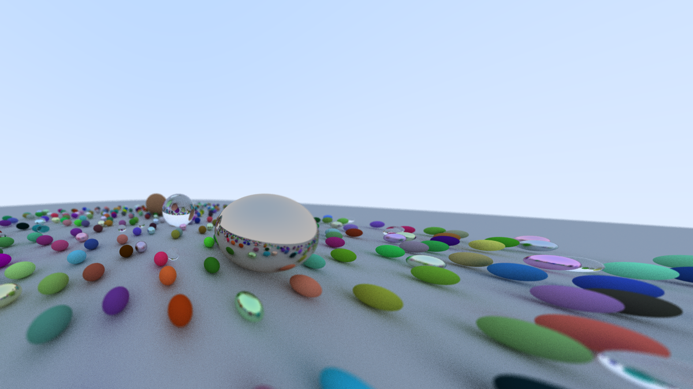

# CRay
Follows the book: [Ray Tracing in One Weekend](https://raytracing.github.io/books/RayTracingInOneWeekend.html). Implemented in C



## Compil & Run
```
gcc *.c objects/*.c materials/*.c -o main -g -lm
./main
```

## TODO
seems like something wrong with the camera placement and defocus feature.